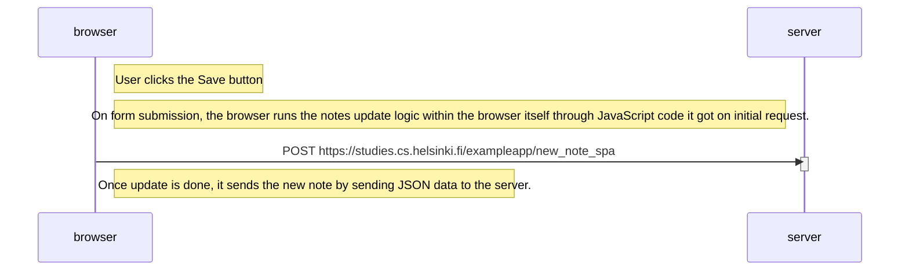

```mermaid
sequenceDiagram
    participant browser
    participant server

    Note right of browser: User clicks the Save button

    Note right of browser: On form submission, the browser runs the notes update logic within the browser itself through JavaScript code it got on initial request.

    browser->>server: POST https://studies.cs.helsinki.fi/exampleapp/new_note_spa
    activate server
    deactivate server

    
    Note right of browser: Once update is done, it sends the new note by sending JSON data to the server.
```
